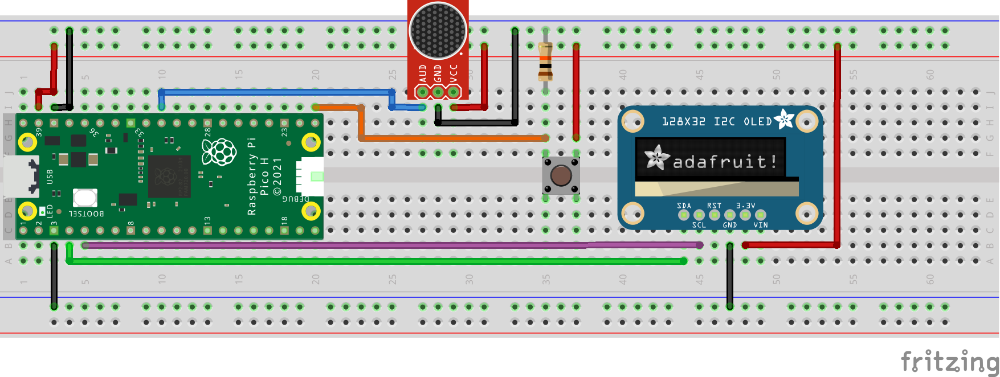

# RP2040 Spectrum Analyzer

A spectrum analyzer, using the RP2040 microcontroller.

## Breadboard using the Raspberry Pi Pico board

## Parts list

- Raspberry Pi Pico H
- 128x32 I2C OLED Display
- SparkFun Breakout Board for Electret Microphone
- 10kΩ Resistor
- Pushbutton
